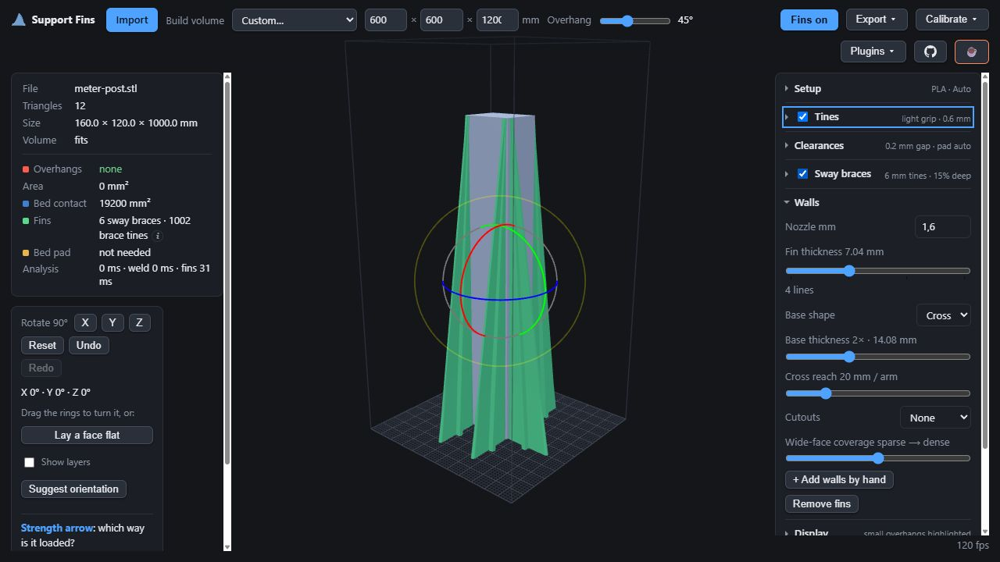

# Nozzle profiles and reinforcement for tall prints

These controls prioritize thicker support walls and stability for large prints.
They run in the browser and export with the fins, so you can adjust supports after
choosing a print orientation without returning to CAD.

The geometry is covered by automated tests and browser checks, including a
1,000 mm post. The new nozzle profiles, cross ribs and reinforced bases have **not
been physically print-validated**. The older 249 mm ASA sway-brace tests in
[FIN-SPEC.md](FIN-SPEC.md) apply to the original dimensions only.

## Choose wall thickness

1. Import and orient the part. Draw is selected by default; choose Auto or Full
   coverage under Setup → Placement when you want automatic support placement.
2. Under **Walls**, enter the nozzle diameter in millimetres (0.2–3 mm).
3. Move **Fin thickness** to 2, 4, 6 or 8 lines. The displayed thickness is
   `nozzle × 1.1 × line count`.
4. Match the slicer's line width to `nozzle × 1.1` and set **Layer height** to the
   layer height you will slice at. Layer height accepts 0.08–2.4 mm; the field's
   range is not a recommendation for every nozzle.

For a 1.6 mm nozzle, line width is 1.76 mm:

| Lines | Fin wall thickness |
|---|---|
| 2 | 3.52 mm |
| 4 | 7.04 mm |
| 6 | 10.56 mm |
| 8 | 14.08 mm |

The profile applies to ordinary walls, wedges and sway ribs in Auto, Full coverage
and committed Draw supports. Their contact tips and grip tines stay one line wide;
tines stay one layer high. Selecting a thicker wall does not scale the material's
support gap. Foot plates have rounded ends inside their previous clearance envelope.

**Browser defaults:** Draw placement, 0.4 mm nozzle, two lines (0.88 mm walls), rounded feet,
Taper base, 1× base thickness, 0 mm base spread, sway off and solid walls.
These intentionally differ from the older browser's wall and foot geometry.
Slicer/CAD plugin dialogs do not expose these new controls yet and retain the
original dimensions. Direct engine callers that omit a nozzle profile also
retain those dimensions.

## Widen the base in two independent ways

With **Base shape → Taper**:

- **Base thickness** sets plate-level thickness to 1–4 times the actual support wall
  thickness (including the Sway minimum), in steps of 0.25. For example, a 7.04 mm wall at 2× becomes 14.08 mm
  thick at the plate.
- **Base spread** extends each end along the original fin plane by 0–300 mm.
  This is separate from the thickness multiplier.

The added solid tapers back to the original wall over its lower 20% of height,
shortened when a contact begins lower. It follows the actual wall section at that
height, including sway ribs that already narrow. At 1× and 0 mm no reinforcement
is added. Rounded bases use inscribed corner arcs, not a fillet into the plate.

## Add a cross almost all the way to the top

Choose **Base shape → Cross** to add a perpendicular rib. Its arms narrow upward
and remain visible until 0.5 mm below the highest full-width wall station. It leaves
the original thin breakaway neck and contact geometry intact.

- **Cross reach** sets reach beyond each side of the original wall at the plate:
  5–80 mm per arm, default 20 mm. Reach is independent of fin height and length,
  so a metre-high support does not automatically grow an enormous cross.
- **Base thickness** sets the cross rib's plate-level thickness. Extra thickness
  on the original fin still tapers over its lower 20%.
- **Fin thickness** also sets the Cross rib's minimum thickness throughout its
  height: `nozzle × 1.1 × 2/4/6/8 lines`, or the Sway minimum if that is thicker.
  With Base thickness at 1×, the rib has constant thickness. Higher multipliers
  taper back to that full thickness, never below it. Only arm reach narrows.
- **Base spread** is hidden and ignored in Cross mode. Its value is retained for
  switching back to Taper.

In Draw, base-control edits rebuild the manual fins directly, without waiting for
a new seating/pad pass. The text beneath **Cross reach** reports the arm reach
actually built. If geometry limits it, the requested and built values can differ;
increasing the request may leave the same arm size when no larger arm clears the
model or neighbouring supports. Cross reach changes plate-level arm reach, while
the near-top arm dimensions remain tied to the wall thickness.

The cross follows the original wall toward its top and has a rounded foot
of its own. Low contact tails do not shorten the whole cross. If the body is too
short, curved or unsuitable, no detached rib is created.
If the original body's top is narrower than the full-thickness rib, the builder
also tries positions aligned with either end of that body section. It checks the
overlap at four heights and uses the existing exact part/neighbour clearance
tests. If none fits, it reports an omitted cross rather than making it thinner.

Browser example using a generated 160 × 120 × 1,000 mm post: 1.6 mm nozzle,
four lines (7.04 mm walls), 0.6 mm layers, sway braces at 15% depth, Cross shape,
2× base thickness and 20 mm Cross reach. This is a geometry preview, not a print result.

## Brace sides and small features

Enable **Sway braces (tall parts)** to tie upright faces to a rib using tines along
their height. Auto picks suitable upright sides. In Draw with Sway enabled, click
a feature once to place a fin, including a small wing or sloping side. Turn Sway
off to draw ordinary walls with two points. **Brace depth** is a percentage of
height and is separate from Cross reach.

Manual placement first tries the ordinary brace. If that cannot reach the clicked
feature, it fits a fin to the selected surface. For a top/underside or steep face,
it can use a nearby side edge and reports the distance from your click. When the
model underneath blocks the fin, it tries progressively larger outward base
offsets (up to 256 mm), keeping the contact at the feature. The readout shows the
extra offset; it is separate from Base spread and Cross reach. The fin still has
to clear the model, other fins and their feet, and keep printable slopes.

A small feature may provide only one grip tine. Manual fitting accepts that and
reports **less contact than a normal sway brace**; Auto retains its three-tine
and coverage requirements. A thicker or larger fin does not create more contact
area on the wing. Consider several fins or another contact location when grip is
limited. If no printable contact fits the selected layer height, placement still
fails with a contact-specific reason. These manual fits are geometry-tested,
not physically print-validated.

With a nozzle profile, sway ribs use `max(selected wall thickness,
min(2.4, 1.2 + 0.004 × rib height))` mm. The print-tested height-based thickness
remains a minimum; a profile can make it thicker. At 249 mm the minimum is about
2.2 mm, even with the default 0.88 mm wall profile. Ribs use the complete Brace
depth percentage without the original 60 mm depth cap.
A 1,000 mm rib at 15% therefore reaches about 150 mm from the face
at the plate. The existing taper toward a 4 mm top remains.

## Check and export

The added reinforcement is checked against the part and neighbouring supports.
Blocked cross arms are tried at shorter reaches or omitted; blocked Taper ends
can remain unextended. The readout reports partial and skipped reinforcement.
Part-mounted supports are not reinforced from the plate. Reinforcement belongs to
its original support, so selecting, removing, undoing and exporting a fin includes
its added base or cross.

**Suggest + Add limitation:** Draw reinforcement avoids Auto supports, but the
Auto worker does not receive hand-placed walls when generating its bases. An Auto
base can therefore grow into a drawn wall. The readout warns when added Auto bases
and hand-placed supports are combined. Inspect these intersections in the slicer,
or use Draw only. This PR does not claim bilateral collision protection.

Export STL or 3MF and inspect the sliced result, especially the first layers,
contact tines, wall continuity and breakaway gaps. Like the existing feet, the
reinforcement uses closed solids that overlap their own wall; the slicer must union
them. The on-screen mass estimate counts these overlaps before union, so use the
slicer's estimate for material planning. The new reinforcement does not cut away
an existing collision in the original support geometry.

Support generation uses CPU mesh calculations in background workers. Draw's
manual supports and previews share a persistent worker that caches the model;
the existing automatic/pad worker handles seating and the bed pad independently.
Export waits while supports are being regenerated or a generation error remains.
It also waits for queued settings changes. A small **Calculating in background…**
notice appears at the bottom of the viewport while settings, pad/Auto, manual-fin
or preview work remains pending. It disappears when all current stages finish;
very quick updates avoid flashing it. The notice leaves the controls available.
The interface remains available during support generation; import, pose analysis,
mesh display and export still include work on the UI thread.

See the [performance report](PERFORMANCE.md) for the multi-core experiment and
why a larger worker pool is not yet used for a single placement. Complex collision
checks can still take time. GPU computing, a native desktop wrapper, base fillets
and physical validation across large printers remain future work.

## Regression coverage

Run `deno test -A` from the repository root, matching GitHub CI. The profile,
base-reinforcement and cross-base tests cover measured thickness, closed and
outward-wound geometry, obstacles, tall/sloping fins, original contacts, owned
triangle ranges and STL/3MF round trips. The golden suite preserves the old engine
references and adds browser-default references for Auto, Draw, PETG and sway.

The profile concept builds on
[oliveiracelso's Dowell profile](https://github.com/oliveiracelso/support-fins/blob/main/web/print-profile.js).
Windows test paths and the explicit OCCT test loader are adapted from
[MiSTRFiNGA's fork](https://github.com/MiSTRFiNGA/support-fins/commit/9dd02d69169f5a1ba54c1e53334a86a65e1cf7bf).
